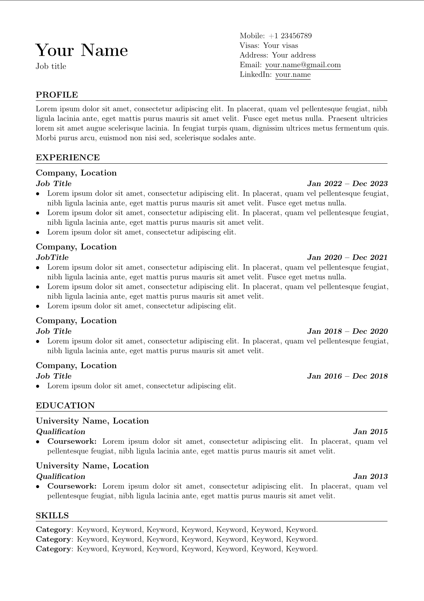
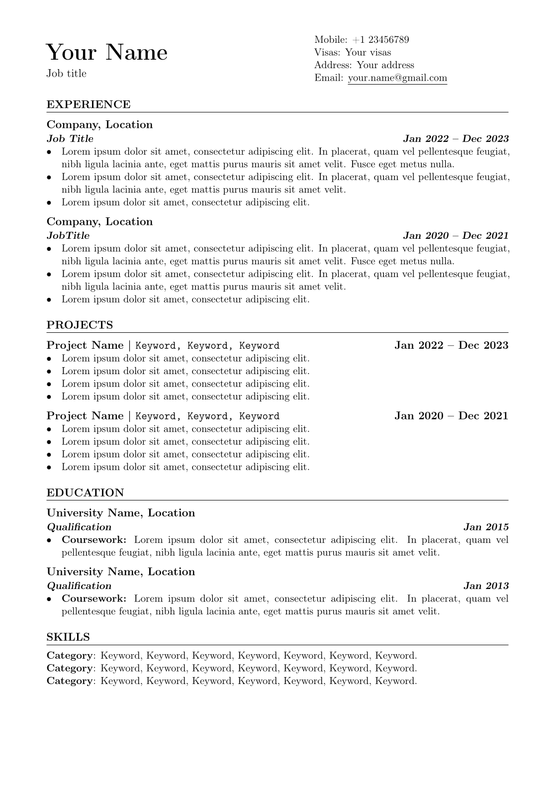

## ATS-Friendly CV

Inspired and based on the [Rover Resume from Subidit](https://github.com/subidit/rover-resume).

### Features

- Simple layouts, default fonts, no special characters.
- Uses common packages only, in a straight-forward manner
- Correctly parsed by `pdftotext` (raw), `PyMuPDF`:
  - Characters are properly extracted, none missing
  - Lines are extracted in the same sequence as presented in the PDF
- Bare-bones, easily tailored to your preferences
- Generates multiple outputs at one go

### Usage

Build your resume:

    make

You might need to update the variables in `Makefile` or update your LaTeX environment.

### Personalisation

Edit the contents in `src/variables.tex` and in the files under `sections`.

### Recommendations for ATS-friendliness

- Avoid links besides email, LinkedIn, Github, or put them in the last section only. Links can affect parsing.
- Keep to single-line items in bullet lists; some items can be two lines, never more.
- Avoid hyphens in words as they maybe converted to soft hyphen if that appear at the end of a line. Disabled hyphenation to mitigate the issue.
- Don't use extra characters such as (<, >, -, +, etc); they add little information.
- Keep sentences simple, start with verbs (like in this list).
- Use past tense
- Match your job title with the one you are applying for

### Example

First example             | Second example
:-------------------------:|:-------------------------:
  |  

### License
ATS-Friendly CV © 2024 by Sylvain Bougerel is licensed under CC BY 4.0. To view a copy of this license, visit https://creativecommons.org/licenses/by/4.0/
